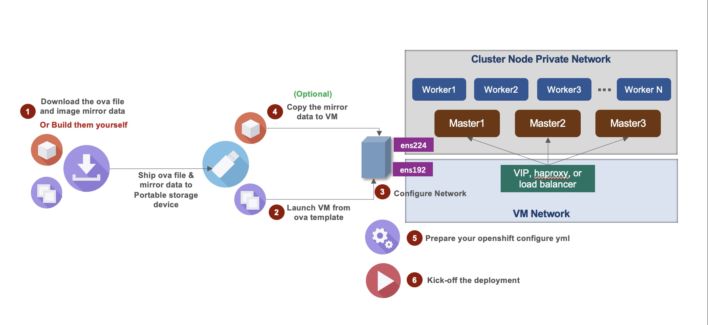

# ocp4-vsphere-automation

## Pre-requisites

From your ansible control manager host, make sure pyvmomi module installed for your ansible python env.
Enable epel repo, then:
```
yum install python2-pip
```
or `python3-pip`, depends on your python version used by ansible
```
pip install PyVmomi
```

## Quick Start
Here are the steps for online installation:

```shell
git clone https://github.com/lxin-git/ocp4-vsphere-automation-airgap.git
cd ocp4-vsphere-automation-airgap
cp mycluster.yml.sample mycluster.yml
```

`vi mycluster.yml` , check description [here](#cluster-configuration-sample).
```
ansible-playbook tower_start.yml -e @mycluster.yml
```

For Single Node Openshift deployment, run the following playbook, for sno configuration see [openshift cluster configuration](#cluster-configuration-sample) for SNO section:
```
ansible-playbook sno_start.yml -e @mycluster.yml
```


## For Airgap Installatioin
The Overall procedure like following digram:


### 1. Download the offline images

Take the deployment of openshift 4.8.28 as an example:
- Download the ova template for deploying openshift:  [ocp-inf_nomirror.rh8.ova](http://xmedia-1.fyre.ibm.com:8080/templates/ocp-inf_nomirror.rh8.ova)
  For instructions on how to create a template, you can refer to this section: [Create Infra OVA](#create-infra-ova)

- Download the mirror data corresponding to openshift version:  [image_mirror_ocp_release_4.8.28.tar](http://xmedia-1.fyre.ibm.com:8080/mirror/image_mirror_ocp_release_4.8.28.tar)
  Please refer to this document for how to generate the mirror data of the specified openshift version: [Prepare Mirror Data](#prepare-mirror-data)

After downloading the above two files, you can copy them to the customer environment through a portable storage device.

### 2. Import the ova template

The ova template you downloaded will be used to start the infra node of openshift, and it will also be the control node for automated openshift deployment.

* First confirm the name of the openshift cluster you want to deploy, eg. we need to name the cluster `mcm`.
* Create a vm folder in the customer's vsphere environment through vcenter and name it `mcm`.
* Import the ova file through vcenter and create a vm in the `mcm` folder, eg. we named the vm `mcm-inf`.
* Specify nic1 and nic2 to connect to public network and private network respectively
* Start vm

> When creating a vm through ova, it is recommended set the hard disk size to 500G, and the communication with your customer about network connections. The vm has two network inferfaces, one of which is connected to the public network of the vsphere environment, usually `VM Network`, and the other is connected to the openshift cluster private network, for example: `vlan30`

### 3. Configure IP Address

* Login to the vm through vm console (login creds: `root/Dem0@ring`)
* Set the vm ip address by `vim ~/network-init.sh`

```bash
NEWHOSTNAME=mcm-inf.cn.ibm.com   # The new hostname for the infra node, usually set to <clustername>-inf.<base domain>
PUBLIC_IP=9.112.238.102/24       # public ip address & net mask assigned to this infra node
PUBLIC_GATEWAY=9.112.238.1       # public gateway address for this infra node
PRIVATE_IP=192.168.30.120/24     # private ip address & net mask assigned to this infra node
PRIVATE_GATEWAY=192.168.30.254   # public gateway address for this infra node
DNS1=9.112.252.58                # nameserver1
DNS2=9.110.183.72                # nameserver2
```

* After modifying the above parameters, run the script to complete the IP setting: `./network-init.sh`

### 4. Copy mirror data file

* After confirming that the vm can be access from public network, now you can copy the downloaded mirror data file `image_mirror_ocp_release_4.8.28.tar` to `/root/ocp4-vsphere-automation` and extract it:
```
cd /root/ocp4-vsphere-automation
tar xvf image_mirror_ocp_release_4.8.28.tar
```

> If you already mirrored ocp release during the ova creation(refer to the options in [`Create VM for Infra Node`](#create-vm-for-infra-node)), please ignore this step.

### 5. Prepare your openshift configure

Now you can start to define your openshift configuration.

* Extract the playbooks for automated deployment

```
cd /root/ocp4-vsphere-automation
tar xvf playbooks.tar.gz
```
* Create an openshift deployment configuration file from the sample config

```
cd /root/ocp4-vsphere-automation/playbooks
cp mcm-airgap-infra.yml.sample mycluster.yml
```

* Modify the openshift deployment parameters via `vim mycluster.yml`, **ONLY** need to modify the value of the parameters marked with `>>>`, check detailed description for [openshift cluster configuration](#cluster-configuration-sample)

### 6. Start to deploy openshift
After the deployment configuration ready, you can start automatic deployment:
```
chmod +x airgap_deploy.sh
./airgap_deploy.sh mycluster.yml
```

## Create Infra OVA

If required, you can create your own ova file in your vsphere environment. follow the steps here.

Before you start, get the playbooks:
```
git clone https://github.com/lxin-git/ocp4-vsphere-automation-airgap
```
### Prepare a base VM template

You're required to have an existing VM template in advance, the minimum setup for the base OS as below:

- Operation System: RHEL 7.7~8.5
- Yum repo configured properly
- Perl installed. (`yum install -y perl`)
- Make sure you can assign proper ip address to this vm which is able to access internet

### Prepare Openshift Configure
Refer to above sample.

### Create VM for Infra Node

This procedure will create the VM of infra node based on your existing VM template, after running over the ansible playbook, you will get a VM in your vmware environment which will be used to perform the airgap openshift installation. This playbook will install all the necessary OS packages, download all the required images include relevant openshift-install binary, openshift-client binary etc.

You have two options to create the VM:
- **1. Create VM with release image mirrored**

> In this option, the openshift release images will be automatic mirrored to the registry which is running on this VM.
> The RHCOS image will also be downloaded and stored in the local filesystem.
> This option requires you have good network quality & stability about the internet access.
> And after the VM created, the overall ova file size will grow up to about 15G. Make sure your target vsphere environment can tolerate such kind of big ova import.    

To Create VM with release image mirrored, go to your ansible control manager, and run the following command:
> Please make sure `registry.enabled` set to `true` in the cluster configure yaml before you start the playbook.
```
cd ocp4-vsphere-automation-airgap
ansible-playbook airgap_create_infra_ova.yml -e @mycluster.yml
```

Where the `mycluster.yaml` is the openshift deployment parameters yaml file which can be reused for later installation.

- **2. Create VM to skip release image mirror**
> In this option, the image mirror will be ignored. It will not download RHCOS image either.
> This will allow you to create a light weight infra node VM template, so that you can easy import it to target vsphere environment.
> You can use the [script](https://github.com/lxin-git/ocp4-vsphere-automation-airgap/blob/master/tools/00-prepare-mirror-data.sh) to prepare the ocp release image mirror data and RHCOS image separately.
> Which will let you be more flexible for data transmission via portable storage device.

To Create VM and skip release image mirror, run the following command:
```
cd ocp4-vsphere-automation-airgap
ansible-playbook airgap_create_infra_ova.yml -e '{skip_sync_mirror: true}' -e '{skip_download_ova: true}' -e '{skip_mirror_to_file: true}' -e @mycluster.yml
```

### Export to ova

Download & Install the [VMware-ovftool](https://developer.vmware.com/web/tool/4.4.0/ovf).
Export your created VM to ova template:
```
ovftool vi://<vcenter_AdminUser>:<vcenter_AdminPassword>@<vcenter_url>/Datacenter/vm/<vm-folder>/<vm-name> <ova file path>
```
eg.
```
ovftool vi://Administrator@myvc.cn.ibm.com:MYPASSW0RD@vc90.myvc.cn.ibm.com/Datacenter/vm/templates/ocp-infra /data/vmware/ocp-infra.ova
```

## Prepare Mirror Data

There is a script [00-prepare-mirror-data.sh](https://github.com/lxin-git/ocp4-vsphere-automation-airgap/blob/master/tools/00-prepare-mirror-data.sh) to help you create offline mirror data for specific openshift release.
Here is the sample command:
```
export PULLSECRET=<YOUR REDHAT PULL SECRET LOCATION>
./00-prepare-mirror-data.sh -v 4.8.28 -o
```
> You will get the offline package `./ocp4.8.28/image_mirror_ocp_release_4.8.28.tar` with above command

Example of prepare a v4.9.17 mirror data:
```
[root@xbox-mirror mirror-data]# ./00-prepare-mirror-data.sh -v 4.9.17 -o
...
...
 2022-01-25 18:57:43 [_notice_]:
                                  Preparation for Openshift v4.9.17 Completed.
                                  Release mirror data stored in : /data/images/mirror-data/ocp4.9.17/mirror
                                  Openshift Client Package      : /data/images/mirror-data/ocp4.9.17/oc_client.tar.gz
                                  Openshift Install Binary      : /data/images/mirror-data/ocp4.9.17/openshift_install.tar.gz
                                  RHCOS ova template            : /data/images/mirror-data/ocp4.9.17/rhcos-vmware.ova

                                  All required data stored in   : /data/images/mirror-data/ocp4.9.17/image_mirror_ocp_release_4.9.17.tar
```
> Now you can pick the mirror data file `/data/images/mirror-data/ocp4.9.17/image_mirror_ocp_release_4.9.17.tar` and store to your portable storage device for later use.

## Cluster configuration sample
This is the sample cluster configuration yaml, we'are using all-in-one configure for everything. Include ansible inventory, online/air-gapped deployment, multi-node cluster configure, single node cluster configure etc.  
Check the comments to understand the configure items description.
```yaml
ocpconfig:
  #--------------------------------------------
  # Parameter to setup your helper/bastion vm
  #--------------------------------------------

  helper_vm:
    template: template: rh84-01
    hostname: mcm-inf  # >>> match your infra node hostname
    public_network: VM Network
    public_nic: ens192
    public_ip: 9.112.238.116
    public_netmask: 255.255.255.0
    public_gateway : 9.112.238.1
    public_dnsdomain: cn.ibm.com # >>> public dns domain for infra node
    public_dns1: 9.112.252.58
    public_dns2: 9.110.183.72
    private_nic: ens224
    private_ip: 192.168.30.120 # >>> match your infra node private ip address
    rootpassword: Dem0@ring
    memory_mb: 16384
    num_cpus: 8
    disksize: 500
    proxy_env: http://my-proxy.fyre.ibm.com:3128/
    workdir: /root/ocp4-vsphere-automation
  #--------------------------------------------

  bootstrap_ignition_url: "http://{{'{{'}}helper_vm.private_ip{{'}}'}}:8080/ignition/bootstrap.ign"

  config:
    provider: vsphere
    base_domain: cn.ibm.com # >>> openshift cluster base domain
    cluster_name: mcm # >>> openshift cluster name
    fips: false
    pull_secret: {"auths":{xxxxxx}} # >>> put your redhat pull secret here, airgap may not use it, but need something for playbook running, will fix later
  vcenter:
    ip: 9.112.238.90 # >>> vcenter server ip address
    datastore: ds_demo01 # >>> which data store you want use to create the vm for cluster nodes
    network: vlan30 # >>> the cluster private network name
    service_account_username: Administrator@vcenter.cn.ibm.com # >>> vcenter service account name
    service_account_password: 'YourPass' # >>> vcenter service account password
    admin_username: Administrator@vcenter.cn.ibm.com  # >>> vcenter service account name
    admin_password: 'YourPass'  # >>> vcenter service account password
    datacenter: Datacenter0 # >>> datacenter name defined in vcenter
    cluster: cluster0 # >>> cluster name defined in vcenter
    resource_pool: demopool # >>> resource pool name for the openshift cluster deployment
    folder_absolute_path: "/Datacenter0/vm/{{'{{'}} config.cluster_name {{'}}'}}" # >>> change the datacenter name in the string
    vm_power_state: poweredon
    template_name: rhcos-vmware
  download:
    clients_url: https://mirror.openshift.com/pub/openshift-v4/clients/ocp/4.8.28 # >>> change to your required ocp version
    dependencies_url: https://mirror.openshift.com/pub/openshift-v4/x86_64/dependencies/rhcos/4.8/4.8.14 # >>> change to relevant rhcos version
    govc: https://github.com/vmware/govmomi/releases/download/v0.23.0/govc_linux_amd64.gz


  #  >>> Change following config about the vm name, mac address, ip address and hardware configuration for each node

  bootstrap_vms:
    - { name: "mcmbt", macaddr: "00:50:56:a1:16:a1", ipaddr: "192.168.30.121", cpu: 8, ram: 24576, disksize: 50 }
  master_vms:
    - { name: "mcmc1", macaddr: "00:50:56:a1:16:a2", ipaddr: "192.168.30.122", cpu: 8, ram: 16384, disksize: 50 }
    - { name: "mcmc2", macaddr: "00:50:56:a1:16:a3", ipaddr: "192.168.30.123", cpu: 8, ram: 16384, disksize: 50 }
    - { name: "mcmc3", macaddr: "00:50:56:a1:16:a4", ipaddr: "192.168.30.124", cpu: 8, ram: 16384, disksize: 50 }
  worker_vms:
    - { name: "mcmw1", macaddr: "00:50:56:a1:16:a5", ipaddr: "192.168.30.125", cpu: 8, ram: 16384, disksize: 100 }
    - { name: "mcmw2", macaddr: "00:50:56:a1:16:a6", ipaddr: "192.168.30.126", cpu: 8, ram: 16384, disksize: 100 }

  #  >>> Add more worker nodes here if required.
  #  - { name: "mcmw3", macaddr: "00:50:56:a1:16:a7", ipaddr: "10.0.2.46", cpu: 8, ram: 32768, disksize: 100 }
  #  - { name: "mcmw4", macaddr: "00:50:56:a1:16:a8", ipaddr: "10.0.2.47", cpu: 8, ram: 32768, disksize: 100 }


  # Custermize your cluster nodes network configuration:
  static_ip:
    gateway: 192.168.60.254 # >>> match the gateway address for the private network
    netmask: 255.255.255.0 # >>> match the net mask for the private network
    network_interface_name: ens192

  # If you don't have direct internet access, you can leverage the proxy, set it to true if required.
  proxy:
    enabled: false
    http_proxy: http://9.111.141.91:3128/
    https_proxy: http://9.111.141.91:3128/
    no_proxy: "{{'{{'}} config.cluster_name {{'}}'}}.{{'{{'}} config.base_domain {{'}}'}}"
    cert_content:

  # Used for a restricted network setup, set enabled to true will help you setup the local mirror registry
  registry:
    enabled: true
    registry_image: docker.io/library/registry:2
    product_repo: openshift-release-dev
    product_release_name: ocp-release
    product_release_version: 4.8.28-x86_64  # >>> match the openshift version for your deployment
    username: ansible
    password: ansible
    email: user@awesome.org
    cert_content:
    host: "registry.{{'{{'}} config.cluster_name {{'}}'}}.{{'{{'}} config.base_domain {{'}}'}}"
    port: 5000
    repo: ocp4/openshift4
    offline_image_path: /root/ocp4-vsphere-automation
    #-----------------------------------------------------------------------
    # This is used to pull registry image since docker.io has limitation now.
    # Or you can change the registry_image location
    pull_creds: <your docker hub id>:<your password>  # >>> input your docker hub creds here, only required for online action.
    #-----------------------------------------------------------------------

  ntp:
    custom: false
    ntp_server_list:
      - 0.rhel.pool.ntp.org
      - 1.rhel.pool.ntp.org
  storage:
    setup_nfs_sc: true  # decide whether you want setup nfs-storage-provisioner immediatly after ocp ready
    setup_nfs_image: k8s.gcr.io/sig-storage/nfs-subdir-external-provisioner:v4.0.2 # updated the old nfs provisioner image, fix kube v1.20+ nfs provisioner "selfLink was empty" issue, as quay.io/external_storage/nfs-client-provisioner:latest not work for kube v1.20+ 

  #---------------------------------------------------------
  # Specific configure for Single Node Openshift deployment
  #---------------------------------------------------------
  sno:
    enabled: false # >>> set it to true if you want deploy a single node openshift cluster, all the configure for bootstrap_vms, master_vms and worker_vms will be ignored.
    network: DPortGroup # >>> we only support 1 NIC in sno deployment, specifiy which network you want to connect.
    name: "{{'{{'}}config.cluster_name{{'}}'}}-ocp"
    nic: ens192 # nic name for sno node, vmware default use ens192
    ip: 10.0.2.216 # >>> SNO ip address
    netmask: 255.255.255.0 # >>> SNO ip address
    gateway : 10.0.2.254 # >>> SNO gateway
    public_dns1: 9.112.252.58 # >>> dns1
    public_dns2: 9.110.183.72 # >>> dns2
    cpu: 8 # >>> sno vcpu setting
    ram: 32768 # >>> sno memory setting (mb)
    disksize: 200 # >>> sno disk setting (gb)
    installationdisk: /dev/sda # >>> the installed disk. let it be default if not sure.
```

## Supported Downloadable Contents

> You're required to be IBM intranet to download these contents

- Available Infra Node ova templates:

| Downloadable Ova template |
|---|
| [rhel7-infranode-without-mirror-data](http://xmedia-1.fyre.ibm.com:8080/templates/ocp-inf_nomirror.rh7.ova) |
| [rhel8-infranode-without-mirror-data](http://xmedia-1.fyre.ibm.com:8080/templates/ocp-inf_nomirror.rh8.ova) |

- Available Openshift Release Mirror data:

| Mirror Data Bundle |
|---|
| [v4.5.33](http://xmedia-1.fyre.ibm.com:8080/mirror/image_mirror_ocp_release_4.5.33.tar) |
| [v4.6.42](http://xmedia-1.fyre.ibm.com:8080/mirror/image_mirror_ocp_release_4.6.42.tar) |
| [v4.7.39](http://xmedia-1.fyre.ibm.com:8080/mirror/image_mirror_ocp_release_4.6.42.tar) |
| [v4.8.13](http://xmedia-1.fyre.ibm.com:8080/mirror/image_mirror_ocp_release_4.8.13.tar) |
| [v4.8.28](http://xmedia-1.fyre.ibm.com:8080/mirror/image_mirror_ocp_release_4.8.28.tar) |
| [v4.9.17](http://xmedia-1.fyre.ibm.com:8080/mirror/image_mirror_ocp_release_4.9.17.tar) |

## Limitation

- support vmware env only
- support x86-64 arch only
- attache more disks to worker nodes not support at this moment
- creds are displayed in plaintext in the configure yml, vault hasn't been introduced

## Known issues (deprecated)

- ansible vmware_guest module create the same vm name in different folder not work: https://github.com/ansible/ansible/pull/60679
  `vi /usr/local/Cellar/ansible/2.8.5/libexec/lib/python3.7/site-packages/ansible/module_utils/vmware.py`
  ```
  if len(vms) > 1:
  to
  if len(vms) >= 1:
  ```

- ansible create vm encounter "Failed to create a virtual machine : A specified parameter was not correct: disk[0].diskId": https://github.com/ansible/ansible/issues/57653

  `vi /usr/local/Cellar/ansible/2.8.5/libexec/lib/python3.7/site-packages/ansible/modules/cloud/vmware/vmware_guest.py`
  ```
   if hasattr(device.backing, 'fileName'):
   to
   if hasattr(device.backing, 'fileName') and hasattr(device.backing, 'diskMode'):
  ```
